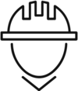

# IN-RH: Plataforma de Gestión Integral de Recursos Humanos

IN-RH es una potente plataforma diseñada para simplificar y optimizar la gestión de recursos humanos en tu empresa. Con IN-RH, puedes llevar un control completo de las operaciones relacionadas con tu personal, desde la contratación hasta la generación de informes estratégicos.

## Características Principales:

- **Alta y Baja de Empleados:** Registra fácilmente la incorporación y salida de empleados, gestionando todo el proceso de manera eficiente.

- **Horarios:** Programa y supervisa los horarios de trabajo de tu equipo de manera sencilla y efectiva.

- **Registro de Gastos:** Lleva un seguimiento de los gastos relacionados con los empleados y el departamento de recursos humanos.

- **Evaluaciones:** Realiza evaluaciones de desempeño de forma personalizable para medir el rendimiento de tus empleados.

- **Tareas:** Asigna y administra tareas relacionadas con recursos humanos y sigue su progreso.

- **Reclutamiento:** Simplifica el proceso de reclutamiento, desde la publicación de vacantes hasta la selección de candidatos.

- **Generación de Análisis e Informes:** Obtén información valiosa con análisis y informes detallados para la toma de decisiones estratégicas.

IN-RH es la solución todo en uno que te permite centralizar y automatizar todas tus operaciones de recursos humanos, mejorando la eficiencia, la productividad y el control de tu organización. ¡Simplifica la gestión de recursos humanos con IN-RH hoy mismo!
